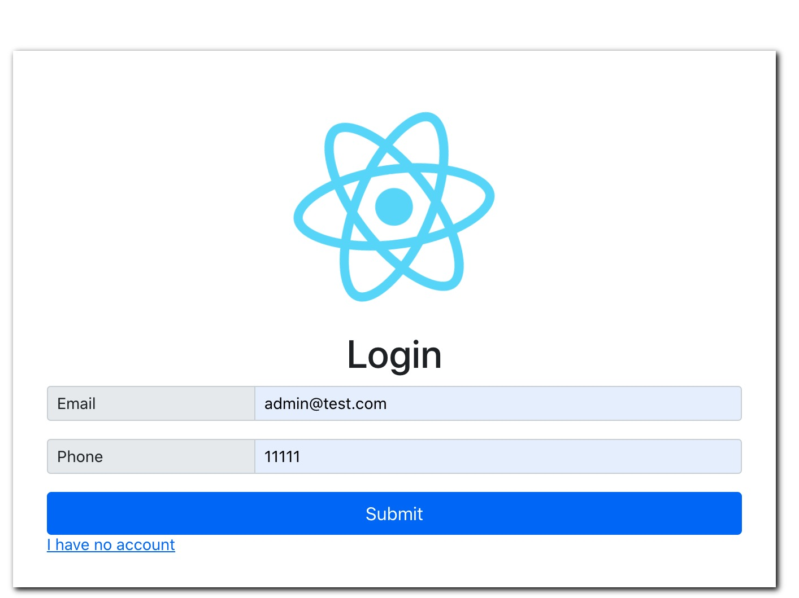
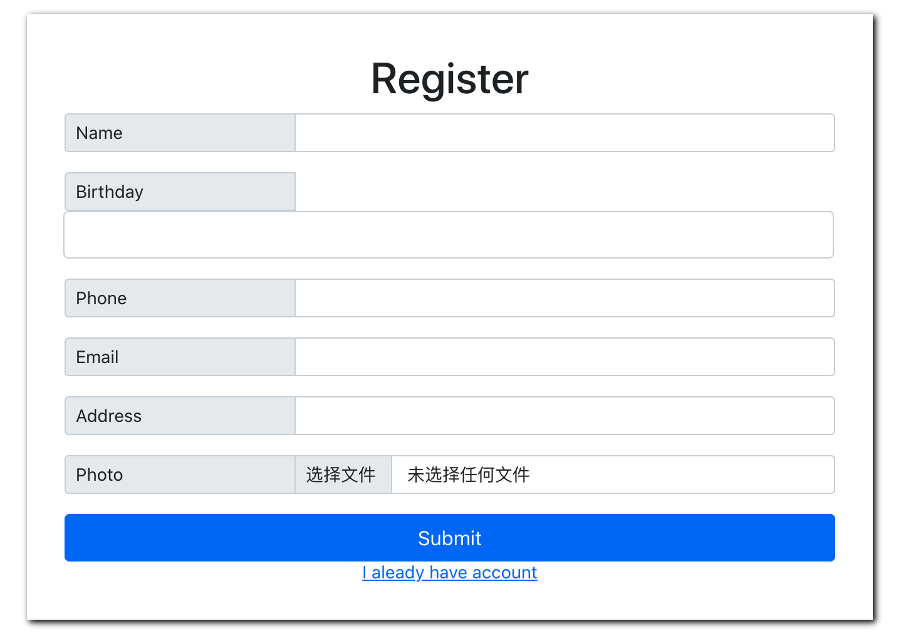
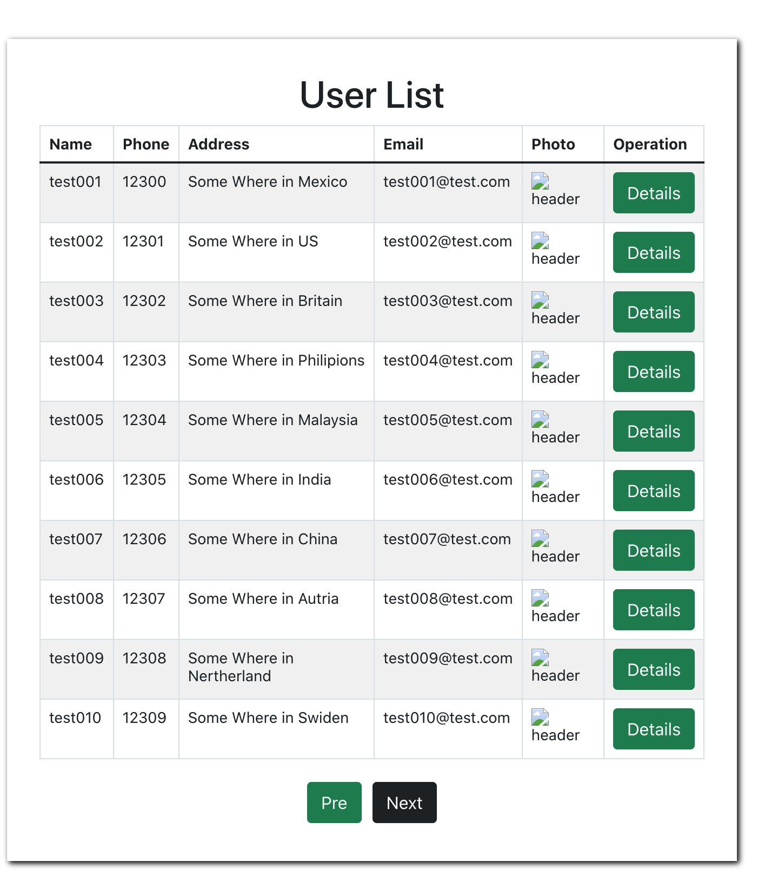

# python_work


## Tech Stack

### Client
* react/react-datepicker
* axios
* bootstrap - ui
* cnpm

### Server
* flask
* sqlite
* conda

### db
please refer to [shcema.sql](./backend/schema.sql)

## How to run 
```sh
./start.sh
```

## How to use
* login: admin/admin is the admin account, register not support
* register: actually is the appointment page
* list: appointment list, need login

and the test data are all list in the schema.sql too.

## Screenshots
login page, include register hyper link and login logic


register page, include login hyper link and forms for register.  
actually it might be appointment register. i was disguided before. (2022/06/02 14:03)


user list, only for admin check users, include a simple pager


## Design
### Restful Api
| api | method | Data| Description |
|----------|--------|-------------|----------|
|index       |  get|None |login page,only frontend,no server required|
|user/register|post|name, birthday,phone number,email, addr,photo|user registration|
|user/login|post|email or phone| a login page|
|user/list|post|None|list all users, only for admin?|


## Test
apologize for this, no time to apply unit test for both side.

## TODO
Due to some problem of myself, things to be done are as below
* input file is very ugly
* cannot load photoes which uploaded before
* password is not encrypted now
* ui/ue is not very good
* uploaded filename should be unique, the md5 should be applyed
* uint test should be implemented